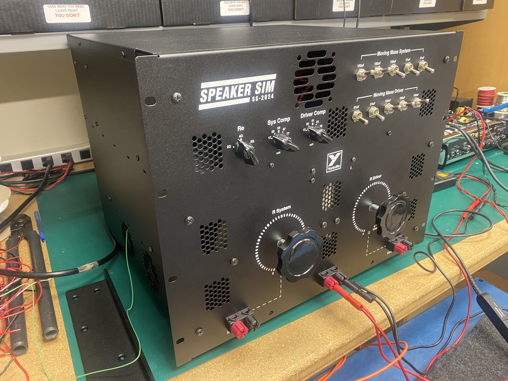
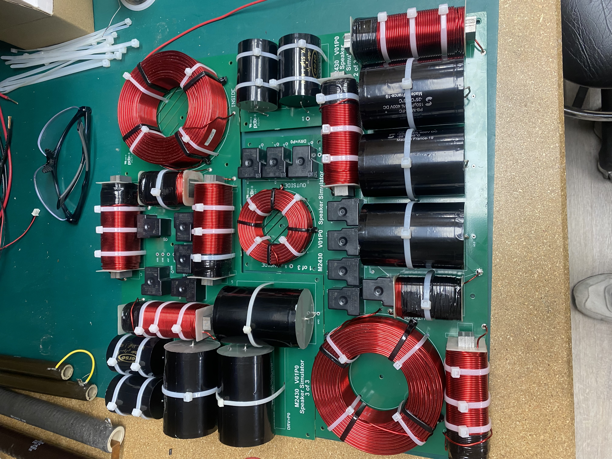
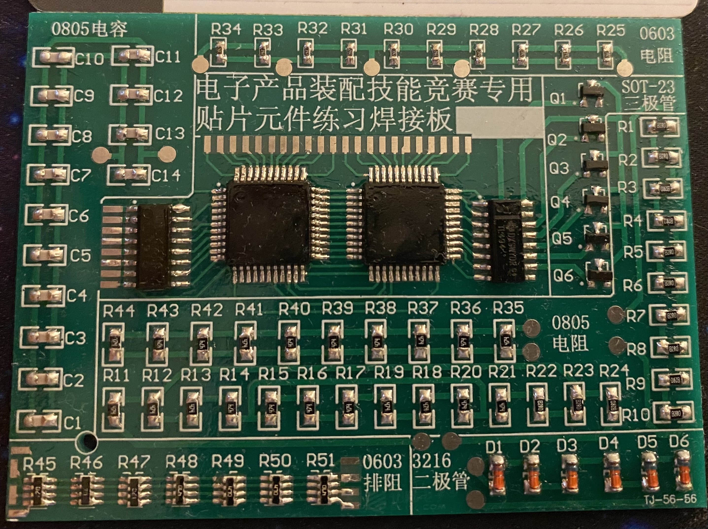
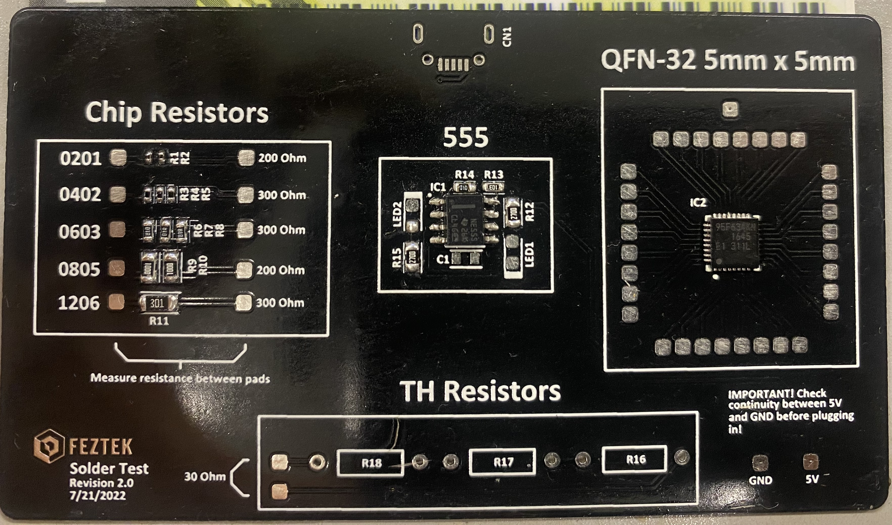
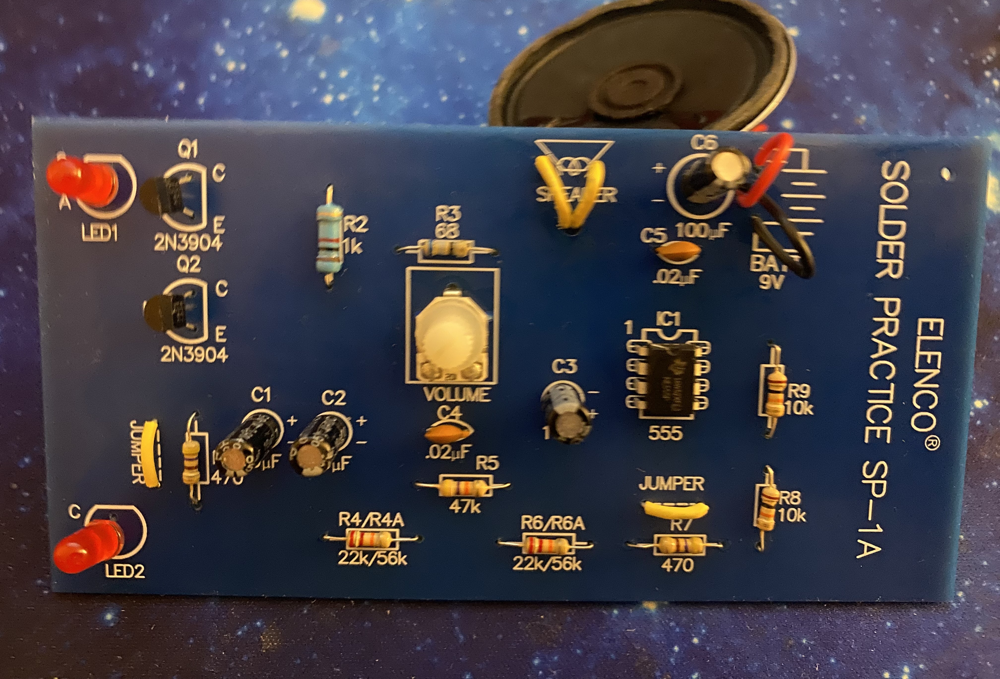
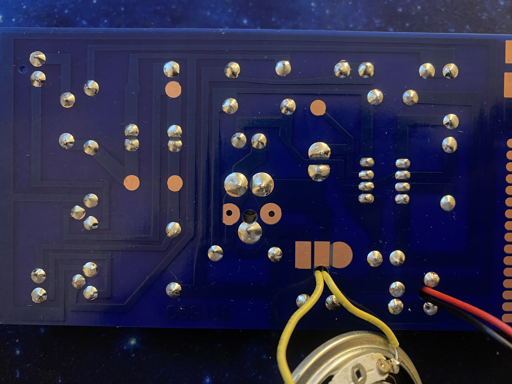

# Electronics Assemblies and Electromechanical Prototypes

This repository contains examples of electronics assembly and electromechanical prototype work including PCB soldering, wiring, SMT and through-hole assembly, mechanical assembly and fabrication.

---

## Electromechanical RLC Fixture Prototype at Yorkville Sound

Designed and assembled an electromechanical RLC fixture prototype used to model the impedance characteristics of a subwoofer.

Work included:
- PCB assembly and soldering
- wiring and connector installation
- mechanical mounting using shop tools
- electrical verification and testing

---

## SMT Soldering Practice

Hand soldered SMT practice boards including 0201, 0402, 0603, 0805, SOT-23, SOIC-8, QFP-54 and hot air reflow for QFN. Work focused on clean solder joints, proper flux usage, and inspection under magnification to IPC-A-610 Class 2 standards.

---

## Through-Hole Assembly

Through-hole soldering practice focusing on consistent solder joints, proper lead trimming, and clean assembly to IPC-A-610 Class 2 standards.

---

## Tools used:
- wire cutters
- wire strippers
- crimping tool
- drill gun / power drill
- screwdrivers
- bolts and nuts for mechanical fastening
- cable ties for wiring management
- RTV Silicone
  
## Equipment Used

- Temperature controlled soldering station
- Microscope inspection
- Multimeter
- Oscilloscope
- Function Generator
- Power supply
- Hot air station
